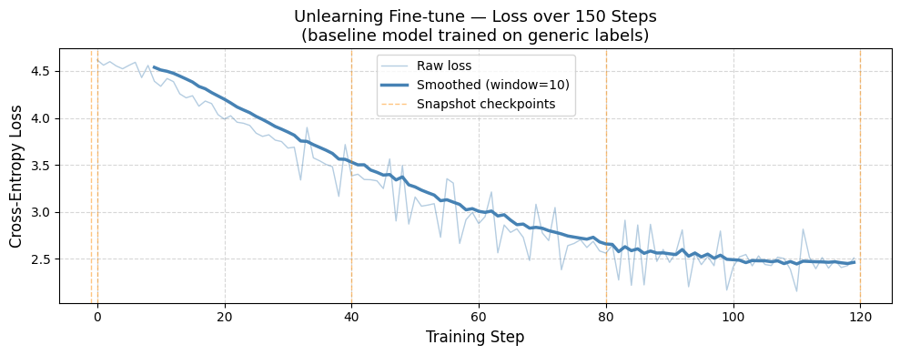

# 🧹 Unlearn-LLM: Approximate Unlearning in LLMs

This repository contains an implementation of the paper [**"Who's Harry Potter? Approximate Unlearning in LLMs"**](https://www.alphaxiv.org/abs/2310.02238) by Ronen Eldan and Mark Russinovich (Microsoft Research, 2023). 

The goal of this project is to demonstrate how a Large Language Model can be forced to "forget" a specific body of knowledge (in this case, the Harry Potter universe) without requiring a complete retraining of the model from scratch.



## 📖 The Core Concept

The paper proposes a novel four-step pipeline to surgically remove knowledge from a model:

1. **Reinforce:** Fine-tune the baseline model on the target text to make the target knowledge "louder".
2. **Translate (Anchors):** Identify idiosyncratic terms (e.g., "Hogwarts", "Quidditch") and replace them with generic equivalents (e.g., "school", "basketball").
3. **Relabel:** Compare the reinforced model to the baseline to identify which token preferences became unusually strong, and subtract that excess to generate "generic" replacement labels.
4. **Unlearn:** Fine-tune the original model toward these generic replacement labels, effectively overwriting the target knowledge.

## 📂 Repository Structure

The project is split into two main approaches to accommodate different hardware constraints:

### 1. `With_GPU/` (Heavy Compute & Deep Unlearning)
Contains `withGpu.ipynb`, a comprehensive Jupyter notebook designed to be run on a GPU environment (e.g., Google Colab T4). 
- Uses **Microsoft's phi-2** model loaded in 4-bit quantization (QLoRA) to efficiently utilize VRAM.
- Implements the complete pipeline: from baseline loading, to reinforced training, to anchor term generation (utilizing the **Gemini API** for automated entity extraction), to generic label computation, and finally the QLoRA unlearning pass.
- Saves model checkpoints and metrics for downstream analysis.

### 2. `Without_GPU/` (Modular & CPU-Friendly)
A clean, modular Python package designed for CPU-friendly experimentation (using lighter models like `gpt2`).
- Provides a CLI entry point (`main.py`) to run the unlearning pipeline end-to-end.
- Organized into a reusable `unlearn/` library module containing focused scripts:
  - `anchors.py`: Anchor extraction and translation.
  - `constants.py`: Global constants including evaluation prompts and default anchor dictionaries.
  - `generic_labels.py`: Implementation of the paper's logit subtraction formula.
  - `pipeline.py`: Orchestrates the 4-step unlearning process.
- Ideal for testing the algorithmic flow, debugging logit subtractions, and running lightweight experiments locally.

### Example Response for Same Input Prompt


## 📊 Analytics and Results

Throughout the training and unlearning phases, we track the model's loss and its probabilities of generating target-specific tokens. The visualizations below demonstrate the shifts in the model's predictive distributions as the unlearning process takes effect.

### Loss Curve:
.png)

### Token Probability Distribution:
.png)

### Unlearning Metrics Comparison:
.png)

## 🚀 Getting Started

### Running the GPU Pipeline
1. Open `With_GPU/withGpu.ipynb` in a Jupyter environment with GPU support (like Google Colab).
2. Ensure you have a T4 GPU enabled.
3. Replace the placeholder with your Gemini API key.
4. Run the cells sequentially to observe the unlearning process on `phi-2`.

### Running the Local CPU Version
Navigate to the `Without_GPU` directory and use the CLI:

```bash
cd Without_GPU
pip install -r requirements.txt
python main.py --target_text data/sample_text.txt --model_name gpt2 --alpha 5.0
```

## 📝 License
This project is open-source and intended for educational and research purposes.
