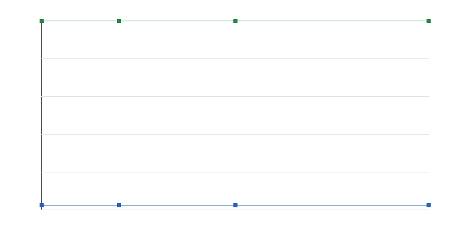

# Unlearn-LLM

Reproducible, CPU-friendly LLM unlearning lab inspired by the approximate unlearning pipeline from ["Who's Harry Potter? Approximate Unlearning in LLMs"](https://www.alphaxiv.org/abs/2310.02238). The project uses a controlled synthetic knowledge base, structured before/after metrics, alpha trade-off reports, failure analysis, CI, and a Streamlit dashboard.

The current checked-in results are intentionally measured: on the saved GPT-2 CPU runs, unrelated prompt retention stays stable, but target forgetting and generic replacement remain weak. That limitation is part of the artifact, not hidden from it.


## Why This Exists

LLM unlearning is the problem of reducing a model's tendency to reproduce a target body of knowledge while preserving unrelated behavior. This repo turns an approximate unlearning idea into a small research engineering project that can be inspected, rerun, tested, and discussed without relying on copyrighted fictional source text.

## What It Implements

The CPU path in `Without_GPU/` implements a four-step approximate unlearning workflow:

1. **Reinforce**: fine-tune a baseline model on the target corpus to make target facts easier to detect.
2. **Translate anchors**: replace invented names and objects with generic labels.
3. **Relabel**: compare baseline and reinforced logits to produce generic replacement labels.
4. **Unlearn**: fine-tune the original model toward those replacement labels.

The polished path is single-model and CPU-first using GPT-2. The older `With_GPU/` notebook remains as exploratory GPU work, but the reproducible project surface is the Python package, saved reports, tests, and dashboard.

## Project Layout

```text
Without_GPU/
  data/synthetic_universe/      controlled fictional dataset
  unlearn/                      pipeline, metrics, reporting, evaluation
  experiments/run_alpha_sweep.py
dashboard/
  app.py                        Streamlit report viewer
  data_loader.py                saved-artifact parser
outputs/alpha_sweep/            checked-in reports, chart, failure analysis
tests/                          deterministic unit and smoke tests
.github/workflows/ci.yml        GitHub Actions test workflow
Makefile                        one-command setup, test, demo, dashboard
```

## Synthetic Dataset

The dataset in `Without_GPU/data/synthetic_universe/` defines invented entities such as Liora Venn, Copper Vale, the Orison Archive, and the Mirrorseed Compass. It includes:

- `target_corpus.txt`: compact repeated target facts.
- `anchors.json`: invented term to generic replacement mapping.
- `forget_prompts.json`: prompts expected to surface synthetic-universe facts.
- `retention_prompts.json`: unrelated prompts used to detect collateral damage.

This keeps the experiment controlled and avoids using copyrighted fictional worlds as the target knowledge source.

## Metrics And Reports

Every run can save reusable artifacts under `outputs/<run_id>/`:

- `report.json`: aggregate metrics, prompt results, and failure categories.
- `prompt_results.csv`: prompt-level probabilities and generations.
- `config.json`: exact run configuration.
- `summary.md`: quick run summary.
- `failure_analysis.md`: representative failures with manual notes.

Core metrics:

- **Forgetting score**: average target-token probability after unlearning. Lower is better.
- **Generic replacement score**: probability assigned to generic replacement tokens. Higher is better.
- **Retention score**: word-overlap stability on unrelated prompts. Higher is better.
- **Failure categories**: prompt-level flags for leaks, incoherent replacement, retention drops, and metric/generation mismatches.

## Saved Results

The checked-in alpha sweep compares `alpha` values `0.0`, `2.0`, `5.0`, and `10.0` from `outputs/alpha_sweep/results.csv`.

| Alpha | Forgetting score | Generic replacement score | Retention score | Prompt count |
| ---: | ---: | ---: | ---: | ---: |
| 0.0 | 0.0247 | 0.0005 | 1.0000 | 13 |
| 2.0 | 0.0247 | 0.0005 | 1.0000 | 13 |
| 5.0 | 0.0247 | 0.0005 | 1.0000 | 13 |
| 10.0 | 0.0247 | 0.0005 | 1.0000 | 13 |



The sweep summary selects `alpha=10.0` by the configured trade-off score, but the numbers show the central limitation: the CPU demo preserves unrelated completions while producing only very small changes in target familiarity and generic replacement probability.

## Example Report Snippet

From `outputs/alpha_sweep/runs/20260815-212618_alpha-sweep-real-alpha-10_gpt2_alpha-10_block-128/report.json`:

```json
{
  "forgetting_score": 0.024690115473223674,
  "generic_replacement_score": 0.000495920563971234,
  "retention_score": 1.0,
  "prompt_count": 13
}
```

Example prompt-level result:

| Field | Value |
| --- | --- |
| Prompt | `In Copper Vale, Liora Venn works inside the Orison Archive as` |
| Baseline target probability | `0.0626` |
| Unlearned target probability | `0.0626` |
| Unlearned generic probability | `0.0005` |
| Failure labels | `target_fact_still_appears_after_unlearning`, `generic_replacement_is_incoherent` |

## Failure Analysis

The `alpha=10.0` run flags 7 failed prompts and 8 failure labels:

- `generic_replacement_is_incoherent`: 7 prompts.
- `target_fact_still_appears_after_unlearning`: 1 prompt.

Representative failure:

> Prompt: `In Copper Vale, Liora Venn works inside the Orison Archive as`

The token-level target probability did not meaningfully drop (`0.0626` baseline vs `0.0626` unlearned), and the generic replacement probability stayed much lower (`0.0005`). This indicates the small CPU run did not create a strong replacement behavior for this prompt.

Full details are in `outputs/alpha_sweep/runs/20260815-212618_alpha-sweep-real-alpha-10_gpt2_alpha-10_block-128/failure_analysis.md`.

## Dashboard

The dashboard is a saved-report viewer. It reads JSON, CSV, Markdown, and PNG artifacts from `outputs/`; it does not load models, train checkpoints, or run inference.

```bash
make dashboard
```

It shows:

- run selector
- aggregate metric cards
- alpha sweep graph
- prompt selector
- baseline vs unlearned completions
- failure table

## Reproduce Locally

Install dependencies:

```bash
make setup
```

Run tests:

```bash
make test
```

Run the CPU demo:

```bash
make demo-cpu
```

Run the alpha sweep:

```bash
make alpha-sweep
```

Customize commands with environment variables:

```bash
MODEL_NAME=gpt2 ALPHA=10.0 RUN_NAME=alpha-10-demo make demo-cpu
```

Expected runtime:

- `make test`: seconds.
- `make dashboard`: starts immediately from saved artifacts.
- `make demo-cpu`: CPU-compatible, but slower because it fine-tunes and evaluates GPT-2.
- `make alpha-sweep`: slower than a single demo because it runs multiple alpha configurations.

Reviewers can inspect the checked-in `outputs/` artifacts without rerunning model training.

## Tests And CI

The repo includes focused tests for:

- synthetic dataset validation
- anchor replacement
- metric calculations
- report writing
- alpha sweep aggregation
- dashboard data loading
- CLI smoke behavior
- Makefile reproducibility targets

GitHub Actions runs `make test` on push and pull request.

## Limitations

- Current polished results are single-model GPT-2 CPU runs, not a broad benchmark.
- The saved alpha sweep shows weak forgetting movement and weak generic replacement behavior.
- Retention is measured with lightweight prompt-completion overlap, not a broad capability benchmark.
- The dashboard visualizes saved artifacts only; it is not an experiment orchestration UI.
- The GPU notebook is exploratory and is not the primary reproducible path.

## Future Work

- Compare GPT-2 and DistilGPT-2 after the single-model version is stable.
- Add stronger retention evaluations beyond word overlap.
- Add richer perplexity and calibration metrics.
- Integrate GPU LoRA/QLoRA runs into the same report schema.
- Add experiment registry metadata for comparing many runs.

## Resume Bullets

- Built a reproducible LLM unlearning lab with a controlled synthetic knowledge dataset, structured forgetting/retention metrics, JSON/CSV reports, and failure analysis.
- Implemented an alpha sweep workflow and Streamlit dashboard to inspect before/after prompt behavior from saved experiment artifacts.
- Added pytest coverage, GitHub Actions CI, and Makefile commands for one-command setup, tests, demo runs, alpha sweeps, and dashboard launch.

## License

This project is open-source and intended for educational and research purposes.
